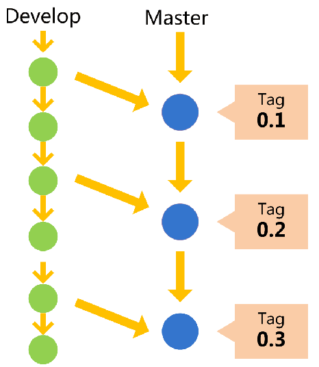
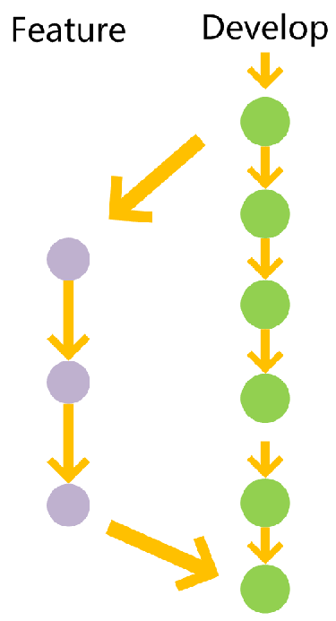
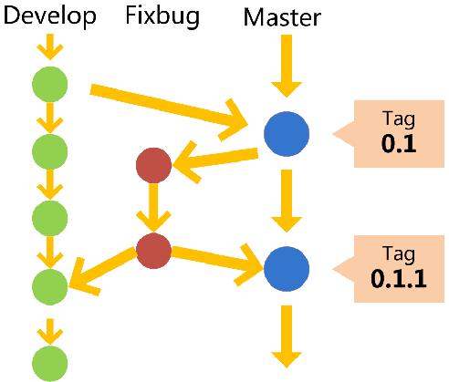

# 版本控制

1、从主repo中fork一个自己的repo。

2、创建新的开发分支。
```
git clone [url]  //把远程仓库克隆到本地
git checkout dev //切换开发分支
git checkout -b [功能分支名称]  //在开发分支上创建功能分支
```

3、将修改提交到功能开发分支上。
```
git add [文件名]  // 添加修改到暂存区
git commit -m ‘提交注释’   // 注释 
git push origin [功能分支名称]:[功能分支名称]   //将本地功能分支上传远程端
```

4、将功能分支和开发分支合并。
```
git checkout [功能分支] //切换功能分支
git merge [dev开发分支] //合并到开发分支
```

5、将自己repo的开发分支提交到主repo分支中

所有提供给用户使用的正式版本，都在主分支上发布。

### 开发分支使用

Master用来发布正式版本，日常开发一般在dev分支上进行。




### 功能开发分支使用

为了开发某种特定功能，从 dev 分支上面分出来的。开发完成后，要再并入dev。



### Bug修复分支使用

修补bug分支是从Master分支上面分出来的。修补结束以后，再合并进Master和 dev 分支。它的命名，可以采用fixbug-*的形式。



### 预发布分支  pre-release

预发布分支，它是指发布正式版本之前（即合并到Master分支之前）的一份分支版本，一般预发布的版本是用来给**测试人员进行测试**的版本。预发布分支是从dev分支上面分出来的，预发布结束以后，必须合并进dev和Master分支。